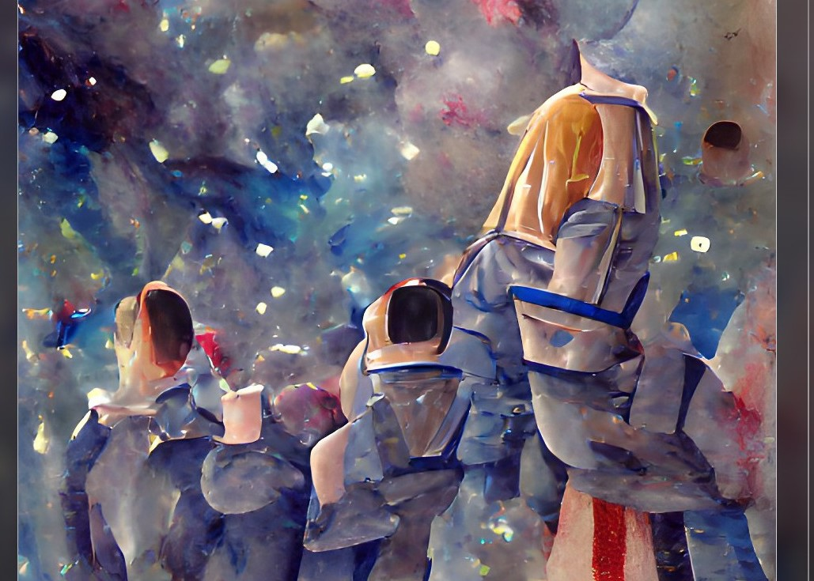

# S.A.D NFTs

Capstone - December 2022

## Team Members
- Dylan Olsen
- Maurine Arandi
- Sam Johnson

## Motivation

- The motivation was to create a decentralized application that will allow users to originate and store artwork as the NFTs. Along the way, we also created a gallery to display and sell the artwork as NFTs. Solidity and Streamlit were the 2 main. The core idea was to efficiently make profitable trades in the stock market.

## 
